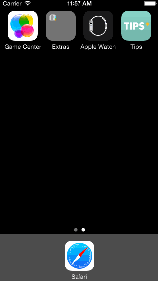

# Tip Calculator by Cameron Lock

This is a simple tip calculator for application to Codepath's iOS for Designers Course. I've restyled the app to be more colorful and inviting. The user can choose from three tip percentages, easily identified by emoticons that represent quality of service.

Time spent: 5 hours spent in total

Completed user stories:

 * [x] Required: User can calculate an 18%, 20% or 22% tip to the second decimal place
 * [x] Optional: Splitting the bill feature
 * [x] Optional: The tip animates when the value changes
 * [x] Optional: Custom fonts, colors and imagery
 * [x] Optional: Custom launch and app icons
 
Notes:

I added a bill split function that I wrote on my own based off of the logic from the other features.

Walkthrough of all user stories:

GIF created with [LiceCap](http://www.cockos.com/licecap/).

Credits:
[Avenir](http://www.linotype.com/1245613/avenir-family.html?PHPSESSID=d595d82bc6aad82d8c80a130a13f4711) Font by [Linotype](http://www.linotype.com).
Fork icon made by [Freepik](http://www.flaticon.com/authors/freepik) from [Flaticon](www.flaticon.com).